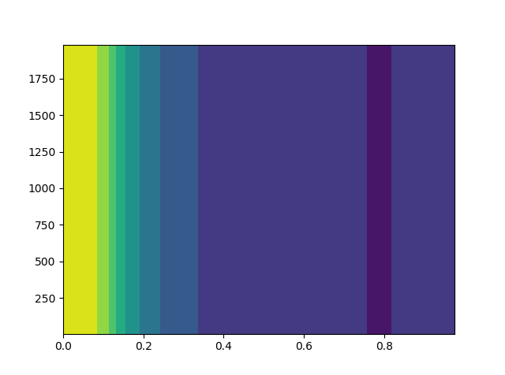
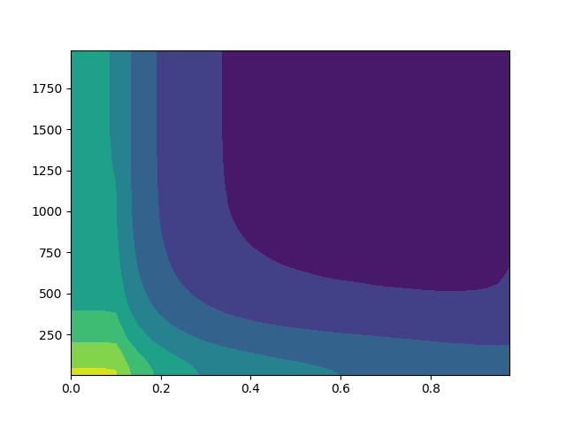

# Hyperparameter Tuning Experiment

Here we try to find the distance threshold between boxes generated from volunteers and boxes obtained from the Mega detector.

The horizontal axis of the images is the minimum confidence the Mega detector must have to count a bounding box in the calculation. 
> For example, if the Mega detector suggests a bounding box with a confidence of 0.72 and the minimum confidence is 0.8, the box is invalid.

The vertical axis of the images is the maximum acceptable distance between the closest centers of the boxes. 
> For example, if there are 2 true boxes in an image and the Mega detector predicts one box __c__. Box __c__ is compared to the other 2 boxes, then is paired with the closer one of the two __d__. Then, if the distance between the centers of __c__ and __d__ is less than the maximum acceptable distance, the box is counted to be accurate. Since the Mega detector only predicted one correct box, it missed 1 box.

For `numbers.csv`, the value of each pixel is the total difference between the number of boxes for each image obtained through volunteers and the Mega detector.

For `box_acc.csv`, the value of each pixel is the total number of boxes labeled by the volunteers that don't have a corresponding box to match with from the Mega detector labeling that is sufficiently close. (_number of "missed" boxes from above._)

