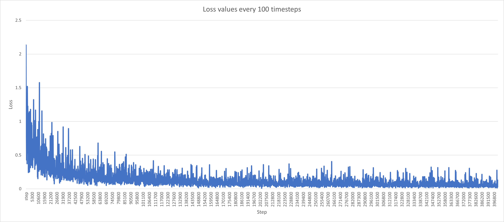

# Finetuning the Megadetector to available Raccoon Data

Here we finetune the Faster Rcnn Tensorflow 1 Megadetector model using Minnesota Super Computing Institute (MSI) compute to obtain
results that could be used with other unlabeled data points.

Available resources:

1. Microsoft Megadetector tensor flow 1

2. 27293 frames of video data

3. A dual K40 gpu machine with 32GB RAM

First, the data needed to be split into Training and Validation in order to measure overfitting and quality of training. A big challenge of our data is the sampling dependence which highly increases overfitting and bias. So, we sampled independently the videos, then selected all the frames of the selected videos to be put in either trainig or validation. The data was split into 21176 training and 6117 validation. We assumed in this case that the videos are not sequentially taken and are taken during independent time intervals.

Second, the data had to be converted into Tensorflow records. To do that we used a simple script that can be found in `raccoon_identification/Mega_detector_raccoon_transfer_learning/images_to_records.py`. 

Third, using the resources mentioned above with the configurations and scripts found in `raccoon_identification/Mega_detector_raccoon_transfer_learning`, we finetuned the Megadetector and obtained the results that can be founf in `highlighted_results.xlsx` (in this directory.)

Using the results, we identified the model from step 310000 to be the best performing one on the evaluation datapoints, thus it will be used in further experiments.

Below is a graph of the training loss captured after every 100 timesteps.

